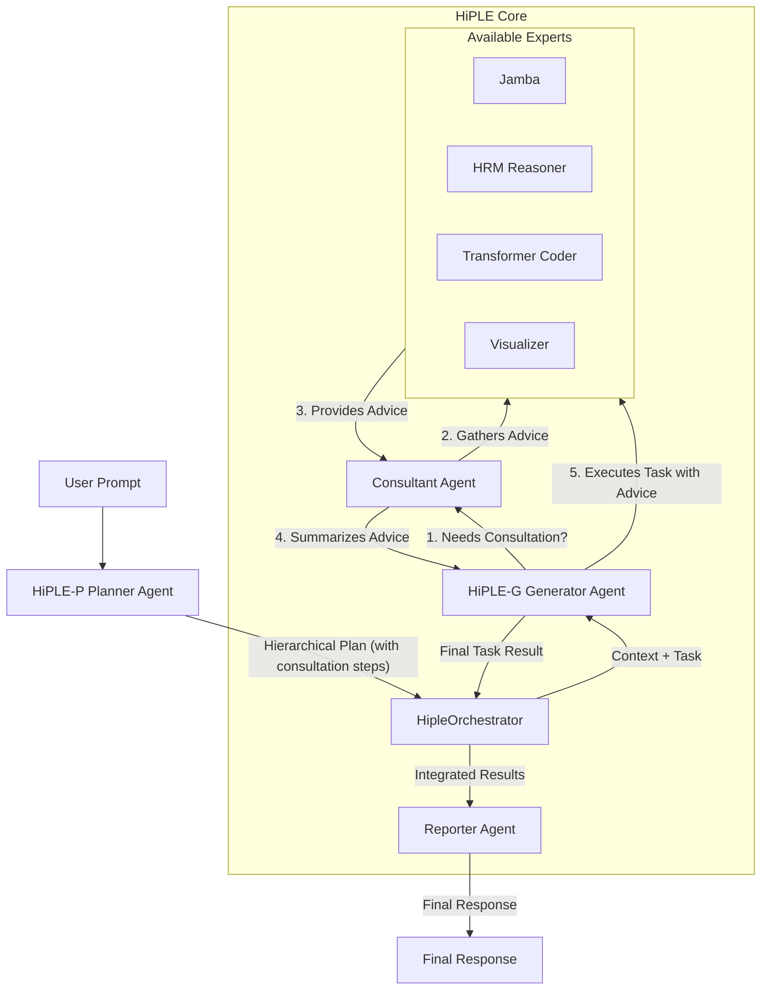

# HiPLE (Hierarchical Predictive Language Engine)
**階層型思考AIシステム**

## 目次
1. [設計思想](#1-設計思想)
2. [システムアーキテクチャ](#2-システムアーキテクチャ)
3. [ディレクトリ構成](#3-ディレクトリ構成)
4. [セットアップとインストール](#4-セットアップとインストール)
5. [使い方](#5-使い方)
6. [動作の仕組み](#6-動作の仕組み)
7. [特徴](#7-特徴)
8. [ロードマップ](#8-ロードマップ)

---

## 1. 設計思想

### 思考の階層化と協調による文脈理解

このシステムは単一の巨大モデルが全てを処理するのではなく、人間の思考プロセスを模倣した**「思考の階層化」**と**「専門家による協調」**をアーキテクチャレベルで実現します。

複雑な問題に対し、まず**階層的な計画（抽象思考）**を行い、計画の全体像と各ステップの目的を理解します。タスク実行時には、必要に応じて他の専門家（エキスパートAI）に**助言を求める（協調的推論）**ことで、長期的で一貫性のある文脈を維持しつつ、多角的な視点を取り入れた質の高い成果を生み出します。

### 思考の3階層モデル

| 階層 | 名称 | 役割 |
|------|------|------|
| **L1** | **全体目標 (Overall Goal)** | ユーザーの曖昧な要求を受け取り、タスクの核心を見抜き、最終的なゴールを定義 |
| **L2** | **主要マイルストーン (Key Milestones)** | 最終ゴールに至るまでの中間目標を設定。物語の「章」のように論理的な区切りとして機能 |
| **L3** | **具体的なサブタスク (Actionable Subtasks)** | 各マイルストーンを達成するための、専門家が実行可能な個別タスク。必要に応じて「相談相手」を指定 |

このアーキテクチャにより、AIは「自分が今、大きな流れのどこにいるのか」を常に把握し、個々の専門性を最大限に活かしながら他のAIと協力して作業を進めることで、スケーラビリティ、柔軟性、思考プロセスの透明性を実現します。

---

## 2. システムアーキテクチャ



---

## 3. ディレクトリ構成

```
/hybrid_llm_system
├── agents/
│   ├── base_agent.py
│   ├── planner_agent.py        # HiPLE-P: 計画立案
│   ├── generator_agent.py      # HiPLE-G: タスク実行
│   ├── consultant_agent.py     # HiPLE-C: 専門家への相談
│   └── reporter_agent.py       # 結果統合
├── config/
│   └── models.yml              # モデル設定
├── container/
│   └── container.py            # DIコンテナ
├── domain/
│   ├── schemas.py              # データスキーマ
│   └── model_manager.py        # モデル管理
├── model_files/                # .ggufファイル配置
├── orchestrator/
│   └── hiple_orchestrator.py   # メイン制御
├── services/
│   ├── model_loader.py         # モデルローダー
│   ├── worker_manager.py       # 外部プロセス管理
│   ├── plan_evaluation_service.py # 計画評価
│   └── retrieval_service.py    # RAGサービス
├── .env                        # 環境変数
├── main.py                     # エントリーポイント
└── requirements.txt            # 依存関係
```

---

## 4. セットアップとインストール

### ステップ1: 依存ライブラリのインストール

```bash
pip install -r requirements.txt
```

### ステップ2: LLMモデルのダウンロード

`model_files` ディレクトリを作成し、以下のGGUF形式のモデルファイルを配置してください：

| モデル | 用途 | ダウンロード先 |
|--------|------|---------------|
| **Jamba** | 高速推論 | [mradermacher/AI21-Jamba-Mini-1.7-i1-GGUF](https://huggingface.co/mradermacher/AI21-Jamba-Mini-1.7-i1-GGUF) |
| **Gemma** | 汎用処理 | [google/gemma-3-4b-it-qat-q4_0-gguf](https://huggingface.co/google/gemma-3-4b-it-qat-q4_0-gguf) |
| **HRM** | 深層推論 | [DavidAU/L3.1-Dark-Reasoning-Dark-Planet-Hermes-R1-Uncensored-Horror-Imatrix-MAX-8B-GGUF](https://huggingface.co/DavidAU/L3.1-Dark-Reasoning-Dark-Planet-Hermes-R1-Uncensored-Horror-Imatrix-MAX-8B-GGUF) |
| **Stable Diffusion** | 画像生成 | [stabilityai/stable-diffusion-xl-base-1.0](https://huggingface.co/stabilityai/stable-diffusion-xl-base-1.0) |

### ステップ3: 環境変数の設定

`.env.sample` を参考に `.env` ファイルを作成し、各モデルへのパスを設定してください：

```env
# .env ファイル例
JAMBA_MODEL_PATH="./model_files/AI21-Jamba-Mini-1.7.i1-IQ1_S.gguf"
TRANSFORMER_MODEL_PATH="./model_files/gemma-3-4b-it-q4_0.gguf"
HRM_MODEL_PATH="./model_files/L3.1-Dark-Reason-Dark-Plnt-Hrm-R1-Uncen-Hrr-Imtr-MAX-8B-D_AU-IQ3_XXS-imat.gguf"
LIQUIDS4_MODEL_PATH=""
VISUALIZER_MODEL_ID="stabilityai/stable-diffusion-xl-base-1.0"
```

---

## 5. 使い方

### 基本的な起動

```bash
python main.py
```

### 対話的な使用例

```
# システム起動後
> Pythonで簡単なWebサーバーを実装し、そのアーキテクチャを説明する画像も生成してください。

# HiPLE-P が計画を立案（コーディングと画像生成のタスク、相互に相談）
# HiPLE-G と HiPLE-C が連携してタスクを実行
# 最終的な統合レポート（コードと画像パス）を出力
```

---

## 6. 動作の仕組み

### 処理フロー

1. **初期化**
   - `main.py` がDIコンテナを通じて `HipleOrchestrator` と各エージェントを初期化

2. **計画立案 (HiPLE-P)**
   - ユーザープロンプトを受け取ると、オーケストレーターは **PlannerAgent** を呼び出し
   - PlannerAgentは、ユーザーの要求を分析し、達成に必要なサブタスクのリスト（実行計画）を動的に生成
   - 複雑なタスクには、助言を求めるべき他のエキスパート（consultation_experts）を指定

3. **計画検証**
   - オーケストレーターは、生成された計画が構造的・意味的に妥当であるかを **PlanEvaluationService** で検証
   - 問題があれば、エラー内容をPlannerAgentにフィードバックし、計画を修正させる（自己修正ループ）

4. **協調的実行 (HiPLE-G & C)**
   - 検証済みの計画に従い、オーケストレーターはタスクを一つずつ **GeneratorAgent** に渡す
   
   **相談**: GeneratorAgentは、タスクに相談相手が指定されている場合、まず **ConsultantAgent** を呼び出し
   
   **助言収集**: ConsultantAgentは、指定された相談相手のエキスパートたちに助言を求め、その結果を要約してGeneratorAgentに返す
   
   **実行**: GeneratorAgentは、受け取った助言を元のタスクのコンテキストに加えてプロンプトを構築し、主担当のエキスパートにタスクを実行

5. **結果統合 (Reporter)**
   - 全てのタスクが完了すると、オーケストレーターは **ReporterAgent** を呼び出し
   - ReporterAgentは、全ての成果を統合し、ユーザーの元の要求に対する最終的な回答を生成

---

## 7. 特徴

### 🔍 透明性
各ステップの思考プロセス（計画、相談、実行）が可視化されます。

### 🤝 協調性
エキスパートが互いに助言しあうことで、単一モデルでは到達できない高品質な結果を生成します。

### 🔄 自己修正
計画の論理的な矛盾を自ら発見し、修正する能力を持ちます。

### ⚡ 効率性
タスクに応じて最適なモデルを選択し、リソースを効率的に利用します。

### 📈 スケーラビリティ
モジュラー設計により、新しいエキスパートや機能の拡張が容易です。

---

## 8. ロードマップ

### 🧠 長期記憶
計画ベクトルをデータベースに保存し、過去の経験から学ぶ自己成長型AIへ。

### 📊 思考の可視化
AIの計画プロセスをUIで可視化し、人間がAIの思考過程を理解できるインターフェースを提供。

### 🔧 機能拡張
- より多様な専門家エージェントの追加
- 外部ツールとの連携強化
- パフォーマンス最適化

---

## サポート・貢献

プロジェクトに関するご質問やバグ報告、機能提案などはIssueでお知らせください。プルリクエストも歓迎いたします。