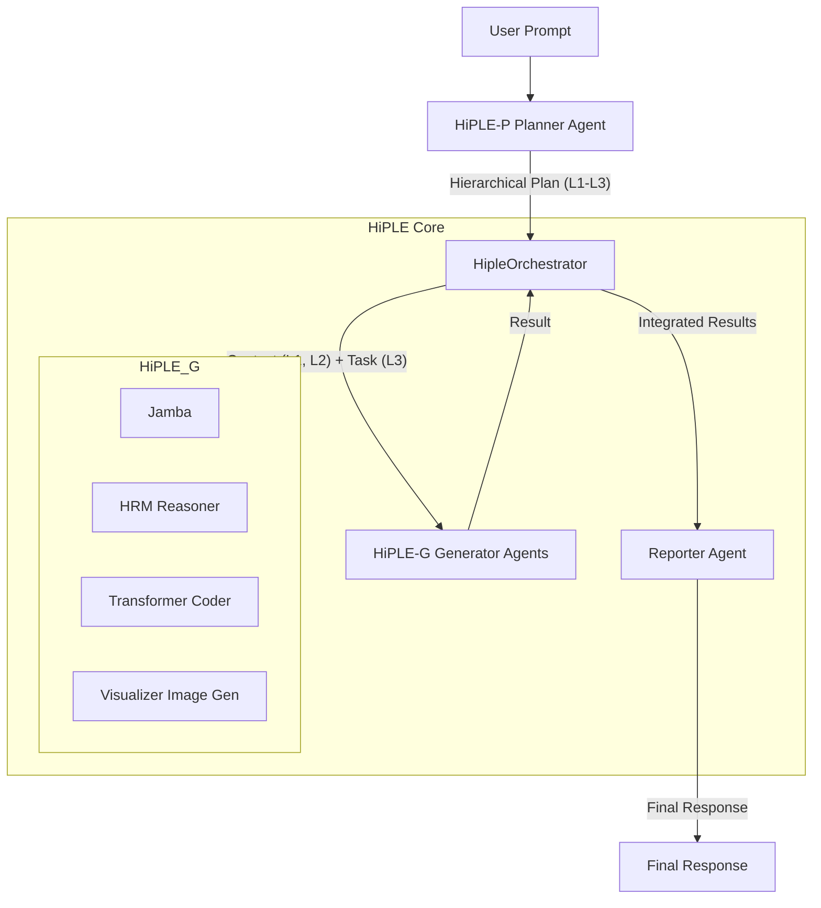

# HiPLE (Hierarchical Predictive Language Engine): 階層型思考AIシステム

## 1. 設計思想：思考の階層化による文脈理解

このシステムは、単一の巨大モデルが全てのタスクを処理するのではなく、人間の思考プロセスを模倣した**「思考の階層化」**をアーキテクチャレベルで実現することを目的としています。

複雑な問題に対し、まず**階層的な計画（抽象思考）**を行い、その計画の全体像と各ステップの目的を理解しながら**具体的な処理（タスク実行）**を逐次的に行うことで、長期的な一貫性と高い精度を両立させます。

### 思考の3階層モデル

* **L1: 全体目標 (Overall Goal)**
    * ユーザーからの曖昧な要求を受け取り、タスクの核心を見抜き、最終的なゴールを定義します。

* **L2: 主要マイルストーン (Key Milestones)**
    * 最終ゴールに至るまでの中間目標を設定します。物語における「章」のように、論理的な区切りとして機能します。

* **L3: 具体的なサブタスク (Actionable Subtasks)**
    * 各マイルストーンを達成するための、専門家（エキスパートAI）が実行可能な個別のタスクです。

このアーキテクチャにより、AIは「自分が今、大きな流れのどこにいるのか」を常に把握しながら作業を進めることができ、スケーラビリティ、柔軟性、そしてAIの思考プロセスの透明性を実現します。

## 2. システムアーキテクチャ



## 3. ディレクトリ構成

```
/hybrid_llm_system
├── agents/
│   ├── base_agent.py
│   ├── planner_agent.py      # HiPLE-P実装
│   ├── generator_agent.py    # HiPLE-G実装
│   └── reporter_agent.py     # 結果統合
├── config/
│   └── models.yml            # モデル設定
├── container/
│   └── container.py          # DIコンテナ
├── domain/
│   ├── schemas.py            # データスキーマ
│   └── model_manager.py      # モデル管理
├── model_files/              # .ggufファイル配置ディレクトリ
├── orchestrator/
│   └── hiple_orchestrator.py # メイン制御
├── services/
│   └── model_loader.py       # モデルローダー
├── utils/
│   └── monitoring.py         # 監視・ログ
├── .env                      # 環境変数
├── main.py                   # エントリーポイント
└── requirements.txt          # 依存関係
```

## 4. セットアップとインストール

### ステップ1: 依存ライブラリのインストール

```bash
pip install -r requirements.txt
```

### ステップ2: LLMモデルのダウンロード

`model_files` ディレクトリを作成し、以下のGGUF形式のモデルファイルを配置してください：

| モデル | 用途 | ダウンロード先 |
|--------|------|----------------|
| **Jamba** | 高速推論 | [mradermacher/AI21-Jamba-Mini-1.7-i1-GGUF](https://huggingface.co/mradermacher/AI21-Jamba-Mini-1.7-i1-GGUF) |
| **Gemma** | 汎用処理 | [google/gemma-3-4b-it-qat-q4_0-gguf](https://huggingface.co/google/gemma-3-4b-it-qat-q4_0-gguf) |
| **HRM** | 深層推論 | [DavidAU/L3.1-Dark-Reasoning-Dark-Planet-Hermes-R1-Uncensored-Horror-Imatrix-MAX-8B-GGUF](https://huggingface.co/DavidAU/L3.1-Dark-Reasoning-Dark-Planet-Hermes-R1-Uncensored-Horror-Imatrix-MAX-8B-GGUF) |
| **Stable Diffusion** | 画像生成 | [stabilityai/stable-diffusion-xl-base-1.0-GGUF](https://huggingface.co/gpustack/stable-diffusion-xl-base-1.0-GGUF) |

### ステップ3: 環境変数の設定

`.env.sample` を参考に `.env` ファイルを作成し、各モデルへのパスを設定してください：

```bash
# .env ファイル例
JAMBA_MODEL_PATH="./model_files/AI21-Jamba-Mini-1.7.i1-IQ1_S.gguf"
TRANSFORMER_MODEL_PATH="./model_files/gemma-3-4b-it-q4_0.gguf"
HRM_MODEL_PATH="./model_files/L3.1-Dark-Reason-Dark-Plnt-Hrm-R1-Uncen-Hrr-Imtr-MAX-8B-D_AU-IQ3_XXS-imat.gguf"
LIQUIDS4_MODEL_PATH=""
VISUALIZER_MODEL_ID="stabilityai/stable-diffusion-xl-base-1.0"
```

## 5. 使い方

### 基本的な起動

```bash
python main.py
```

### 対話的な使用例

```bash
# システム起動後
> こんにちは、複雑な数学問題を解いて、その解法をまとめたレポートを作成してください

# HiPLE-P が計画を立案
# HiPLE-G が順次実行
# 最終的な統合レポートを出力
```

## 6. 動作の仕組み

1. **初期化**: `main.py` がDIコンテナを通じて `HipleOrchestrator` と各エージェントを初期化します。

2. **計画立案**: ユーザーからプロンプトを受け取ると、オーケストレーターは **HiPLE-P (Planner)** を呼び出します。

3. **タスク分析**: **HiPLE-P** は、ユーザーの要求を分析し、達成に必要なサブタスクのリスト（実行計画）を動的に生成します：
   - 単純な挨拶 → 単一のタスク
   - 複雑な要求 → 複数のタスクに分解し、最適なエキスパートを割り当て

4. **逐次実行**: オーケストレーターは、計画に従って **HiPLE-G (Generator)** を呼び出し、サブタスクを依存関係を解決しながら順番に実行させます。

5. **結果統合**: 全てのタスクが完了すると、オーケストレーターは **Reporter Agent** を呼び出します。

6. **最終出力**: **Reporter Agent** は、全ての成果を統合し、ユーザーの元の要求に対する最終的な回答を生成して返します。

## 7. 特徴

- **透明性**: 各ステップの思考プロセスが可視化されます
- **柔軟性**: 新しいタスクタイプに容易に対応可能
- **効率性**: タスクに応じて最適なモデルを選択
- **スケーラビリティ**: モジュラー設計により拡張が容易

## 8. RoadMap

・**長期記憶**: 計画ベクトルをデータベースに保存し、過去の経験から学ぶ自己成長型AIへ。
・**思考の可視化**: AIの計画プロセスをUIで可視化し、人間がAIの思考を直感的に理解・編集できるようにする。
・**動的プランナー**: ユーザーの意図を汲み取り、計画自体を対話的に修正・改善していく、より柔軟なPlannerを構築する。

## 9. ライセンス

本プロジェクトのライセンスについては、各依存モデルの利用規約に従ってください。コード自体はMIT Licenseです。
